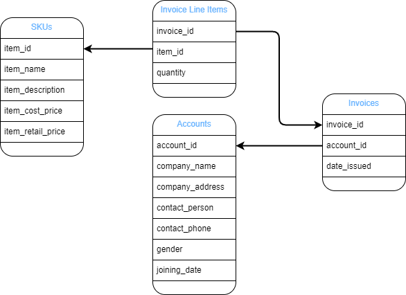

# carsales-challenge

# Task 1

## Problem Analysis

The primary goal of this task is to provide access to data that can be used to assist in predicting payment lapses.  The resulting dataset or datasets will be interpreted by data analysts and data scientists.

Unfortunately, the sample data indicates that there are two key pieces of information missing from the data sources which will make the task difficult:
* There is no indicator of when the invoices are due, only when they were issued
* There is no indicator of when (or if) an invoice was paid

<figure>
  
  <figcaption>Overview of the relationships between data sources in the sample</figcaption>
</figure>

## Assumptions

Based on the problem description and the above analysis I've made the following assumptions:
* That the invoice status (i.e. paid or unpaid) is available to the end user in a separate data stream, and
* The end user is able to include this data along with the datasets

Otherwise, the end user may be viewing the data directly, as a report or dashboard

## Solution

With the following assumptions in mind, I've translated the problem into two functional requirements, and provided a dataset for each.

1. A list of outstanding invoices, including their total amount, ordered by issue date.  The company's contact details are included to assist in notifying them of their upcoming (or lapsed) payments.
1. A list of amount owing by account, ordered by the highest amount, and again with the company's contact details.  This dataset attempts to highlight the businesses with the largest outstanding risk of lapse.

### Code

Generation of the datasets is provided by two functions using PySpark, the python API for Apache Spark.  Both functions can be found under `challenge/invoices.py`, along with some helper functions to generate intermediary datasets (total invoice costs, and invoices with customer details respectively).  Each function assumes that the four incoming datasets have already been loaded into DataFrames - in the example this has been completed by the Spark CSV plugin, but in the production case these could come from other databases, APIs, or elsewhere.

The solution includes code quality and linting using `ruff`, but no unit tests - given the simplicity of the solution and the fact that it mostly consists of operations from the third-party PySpark library it was decided that any tests would be low quality.

### Running the Example

The file at `bin/example.py` provides a way to demonstrate both datasets by:
* Loading the sample data from the CSV files
* Generating both datasets using `challenge/invoices.py`
* Either printing a sample of the results to the screen or writing the entire results to a file

**Pre-requisites**
A system with both `python3` and `pipenv` installed globally - this project was built using python 3.10

**Steps**
* Install dependencies using `pipenv install`
* Open the virtual environment using `pipenv shell`
* Run the example file using `python -m bin.example \[-w\]` where:
  * If `-w` is ommitted it will print a sample of each dataset to the console
  * If `-w` is included it will write both datasets in their entirety under the directory `./out/<dataset-name>_<timestamp>`. The relevant file will be titled `part-<id>.csv`

## Alternatives

If the above limitations did not exist and the goal *was* to predict chance of lapse for a particular invoice I would have a quite different solution, i.e:
* Aggregate the data from all four sources into one large, invoice-based dataset
* Separate out the invoices that have been paid, and group them into at least two categories: paid on time and paid late (though depending on the requirements, I could easily create more categories based on duration of lapse, e.g. paid within a week after due date, within a month, etc.)
* Feed this data into some form of classification model, using a split of the data as training and testing data (most likely multiple times, using cross-validation).
* Take the resulting model and apply it to the invoices that have not yet been paid, then use the results to anticipate potential lapses and proactively contact the account holders before this occurs.

# Task 2

## Problem Analysis

The goal of this task is to design a system that will regularly perform the ETL job in a performant and scalable way, store the results for some period of time, and allow access to the output for a variety of different consumers.  There is also a requirement to adapt the system to be more event-driven based on a future CDC enhancement.

## Assumptions

As the existing data is present in Aurora, the following assumptions have been made:
* For security, the system already contains a VPC, and the Aurora clusters are deployed within it.
* There is a desire to remain within the AWS ecosystem, for simplicity, compatibility, etc.

## Solution

The design can be broken up into three components:
1. The ETL job, and the resources that schedule it to run
1. The mechanism which enables consumers to view and process the job's output
1. The planned future enhancements once the CDC is implemented

<figure>
  
  <figcaption>High level overview of the solution</figcaption>
</figure>

### The ETL Job

In the diagram, flow of data and control for this component is indicated by the *blue* lines.

* As mentioned above, for privacy and security it is desirable to keep as many resources as possible within the private subnet of the VPC.
* This includes the ETL job, which will be run via Spark deployed to an EMR cluster.  This achieves an excellent compromise in recieving all the benefits of Spark while taking advantage of AWS management to ensure availability, scalability, etc.
* The script containing the job, and the files that output it, will be stored in S3 per AWS recommendations.
* The EMR cluster is controlled by the EMR service which sits in public AWS, so communication between the two must use an internet gateway in the VPC.
* In phase one, triggering the job will be done on a schedule, which is best achieved using CloudWatch Events (or the newer EventBridge Scheduler).  This can run on any desired frequency using a cron-like scheduler.
* The actual job trigger that the scheduler will activate is a simple AWS Lambda function, and there are plenty of examples in the AWS documentation of this exact feature.
  * This lambda could also be used to spin the EMR cluster up and down only when needed, but as the second phase will want near-real-time updates we will assume that the cluster needs to be permanently available.
* To retrieve the source data the EMR cluster will connect to the Aurora DB cluster using Spark SQL, all within the VPC.
* The ETL job outputs will begin building up in S3, so a lifecycle rule should be utilised to automatically delete items once they reach a certain age.
  * This can be adjusted based on the desired retention policy, cost considerations, etc.
  * One option is to de-prioritise old data first with a lifecycle rule that migrates it to a different bucket with slower access time but much cheaper storage.  Then a separate policy on this bucket can delete it after some period with no access.

### System Access and Results

In the diagram, flow of control for this component is indicated by the *green* lines.

* There are at least two key consumers mentioned in the requirements:
  * The finance team, who prefer to query data using SQL.
  * The data analysts, who want more direct access as well as the ability to compare with prior results.
* For simplicity, both will be given access to the AWS EMR Studio.  This allows SQL-based queries of the data, supporting the finance team, as well as Jupyter notebooks for the data analysts.  Being fully web based it requires no installation or provisioning other than access control using IAM.
* Additionally, the data analysts can achieve more direct access to both Aurora and the EMR cluster (and anything else in the VPC) via a VPN gateway.
* Access to the temporal data will be implicitly provided by EMR Studio, subject to the data still being available in S3 (due to the lifecycle rules mentioned above).

### Planned Future Enhancements

In the diagram, flow of control for this component is indicated by the *dotted* lines.

* The requirements indicate that the CDC will utilise Apache Kafka, so for the same reasons we used EMR we will also use MSK, AWS's managed Kafka service.
* The CDC mechanism from Aurora will feed directly into this service, with the output going to the EMR cluster.
* The EMR cluster will ingest data from Kafka via the Spark Streaming extension.
* As the ingestion happens automatically, the scheduled trigger can be removed, including both the Scheduler and the Lambda function.

### Additional Notes

The provided system makes use of in-built AWS features to automatically provide a high-level of scalability, availability, robustness, etc.  There are a few other enhancements that could be made which haven't been included here.

* For security and privacy, all the provided data should be encrypted both at rest and in transit.  In-transit will often be inherently handled by the HTTPS protocol, and at-rest explicitly via KMS keys.
* There may be a desire to back up the contents of the S3 bucket in case of data loss.  If so, scheduled backups are probably sufficient for this use case.
* Monitoring of the EMR service offers a number of benefits, and can be achieved using Alarms and Dashboards provided by CloudWatch Metrics.

### Sources

[EMR in a VPC](https://docs.aws.amazon.com/emr/latest/ManagementGuide/emr-clusters-in-a-vpc.html)

[Spark Lambda Trigger Example](https://docs.aws.amazon.com/prescriptive-guidance/latest/patterns/launch-a-spark-job-in-a-transient-emr-cluster-using-a-lambda-function.html)
